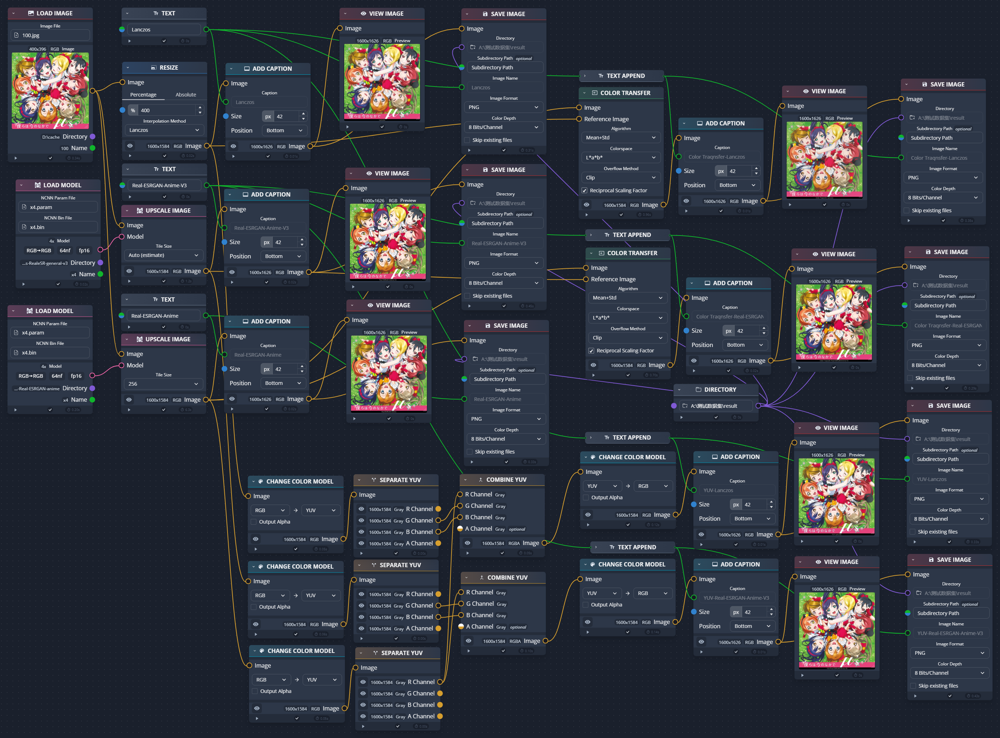
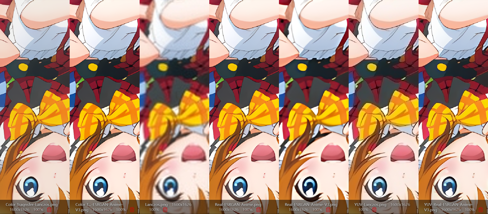
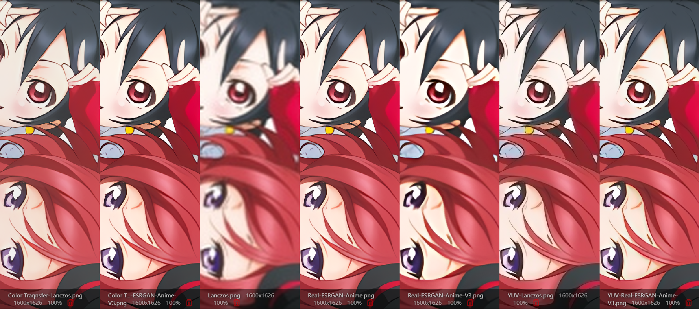

# Luminance Lead Super Resolotion
Almost super-resolution project are based on RGB color space or process single-channel (grayscale) images. This project proposes a practical new approach: converting images to YCbCr color space, applying high-quality super-resolution on the luminance channel, and applying lightweight super-resolution to the other channels. Also the changes in the luminance channel can guide the processing of the other channels, thereby achieving a balance between cost and performance.

# 亮度主导的超分辨率
目前绝大多数超分辨率模型，都是基于 RGB 色彩空间的图片，或者对单通道（灰阶）图像进行处理。本项目提出了一种实用导向的新思路：转换图像到非 RGB (比如 YCbCr 和 Lab) 色彩空间，对亮度通道做高质量超分，对其他通道使用轻量模型超分，并且亮度通道的信息变化可以对其他通道进行指导，从而让超分辨率在计算量和效果之间得到平衡。  

## 主要思想
1. 不同的色彩空间有不同的特性，适合完成不同的工作。众所周知，人眼对亮度的敏感度远高于对其他颜色的敏感度。基于这样的理论，一些图片格式采用了亮度和色度使用不同采样率的方式，来降低图片的存储量，但是人眼并不能观察到明显区别。因此针对亮度通道和其他通道使用不同复杂度的网络进行处理，是一种可行的选择。
2. 实际上计算量最低的实现方式是，直接把 LR 的色度通道（需要为全像素）的信息当作 4:2:0 格式的色度输出；进一步的做法是：对色度通道使用传统采样算法（比如blinear）计算。但是这样的做法存在这样的缺陷：当亮度通道产生突出的优化效果时（如去除了噪点），色度通道优化不足，人眼会产生明显不适。这也就是本项目提出的：使用 LR 到 HR 图像的亮度通道的变化来指导色度通道的处理。
3. 但是毫无疑问，上一条提出的传统算法处理色度通道的方式可以让模型大小、显存占用、计算量都急剧缩小。特别是输入的图像大部分接近于单色/灰阶的场景（比如扫描书），这种做法是可以实用的。并且我在 chaiNNer 中可以直接使用这样的技术（由于目前几乎没有漫画以外的完成训练的单通道模型，我使用了 RGB 模型的结果提取亮度通道作为代替）。
4. 由于训练亮度通道，实际上等同于训练单通道（灰阶）模型，因此 LLSR 无需单独设计亮度通道的网络结构，可以直接使用现有的任意超分项目来代替。
5. 由于亮度信息可以使用任意超分项目来代替，因此在训练阶段，不需要引入实际的亮度模型，而是可以直接分离 GT 图像的亮度通道作为 input2 输入，从而进一步减少训练所需的计算量。
6. 作为思路拓展，不使用亮度通道来引导色度通道的处理，也是有可行性的。即：亮度通道使用高品质超分模型，色度通道使用单独的轻量超分模型。如前所述，色度通道可以使用其他项目的架构训练单通道模型，色度通道同样可以直接使用其他项目的超分模型训练2通道或者3通道模型（做出的改动仅仅只是dataloader需要把图像的色彩空间进行转换而已，没错其他项目虽然默认在RGB色彩空间进行训练，但是也不是不能快速修改）。但是由于缺少亮度信息的参与，这种做法必然导致效果下降。
7. 作为上一点的拓展，色度通道也可以无需训练，而是直接使用已经完成训练的3通道轻量模型，输入 RGB 图像，输出 RGB 图像，由外部程序把输出结果转换为 YCbCr 图像，再拼接高品质模型的亮度输出和转换得到的色度输出。这相当于把第2点的传统算法替换为了超分辨率算法，他们的优缺点是相似的。
8. 额外的，目前大部分程序在处理 alpha 通道时，都选择了传统的插值算法，甚至直接抛弃 alpha 通道的信息。但是实际上，alpha 通道的信息是非常重要的。在一些扫描文件中，甚至会使用两层低分辨率图像，借助精细的透明通道组合构成高分辨率内容。当然，毫无疑问在当前的超分项目中，可以直接设置 channel=4 来训练 alpha 通道，但是这样的做法一方面会导致计算量急剧增加，另一方面 alpha 通道又不需要这样精细的计算；由亮度信息引导 alpha 通道超分也是合适的。

## 路线
- [x] 使用已有的 RGB 模型进行理论验证
- [ ] 训练亮度单通道模型（电子书放大）
- [ ] 训练基于亮度-色度空间的3通道模型（实现优化的黑白模型彩色化）
- [ ] 完成轻量化的电子书放大软件
- [ ] 训练单通道模型（动漫/照片）
- [ ] 训练亮度引导的色度通道模型

## 实验
如前边所述，我使用人人都用过的 RealESRGAN 标配模型搭配 chaiNNer 进行了先期验证。这里一并提供工程文件, 见 assests 目录。  

验证结果如下： 
https://imgsli.com/MzY3MTU4/

整体来看效果还行，但是存在一些缺陷。这里对一些细节进行放大展示，但是这和模型未在亮度分离的模式下训练有很大关系。预计如果单独训练亮度色度分离的小模型后会有明显改善。 

## 其他
我还在完善、训练和测试中。但是由于我缺少足够的算力（同时也缺乏相关知识，模型本身的设计并不优秀），后续所能提供的模型也不能代表这个思路应有的效果。  
希望你能由此出发，训练更加优秀的模型，或者打造出新的实用项目！
